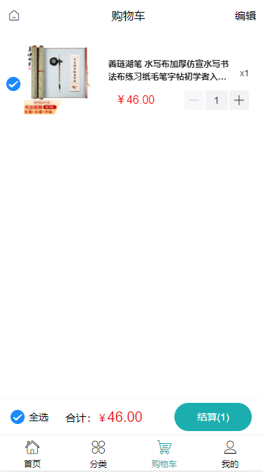

# calligraphy-mall
```
## Project setup
```
npm install 
```

**calligraphy_sql.sql是数据库文件前往db文件夹内的sql.js修改自己的数据库名称和密码**

### Server是项目后端
```
npm run start
```

### 运行下面指令启动前端
```
npm run serve
```

### 项目参考
```
项目的ui模板是参照新蜂商城:https://github.com/newbee-ltd/newbee-mall-vue3-app 
```

## 页面展示


- 登录页


- 首页


- 商品搜索


- 商品详情页


- 购物车




- 订单列表


- 个人页面


### Customize configuration
See [Configuration Reference](https://cli.vuejs.org/config/).
